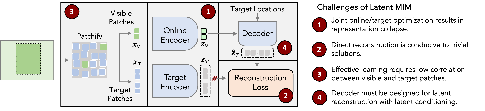
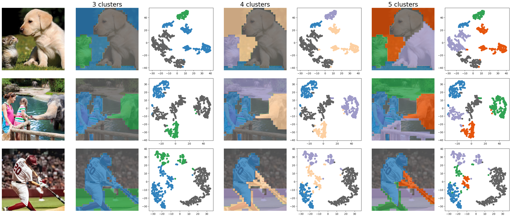

# Towards Latent Masked Image Modeling for Self-Supervised Visual Representation Learning (ECCV 2024)
<a href="https://arxiv.org/pdf/2407.15837"></a> &nbsp;
<a href='https://yibingwei-1.github.io/projects/lmim/lmim.html'></a> &nbsp;
<a href="https://opensource.org/licenses/MIT"></a>

<p align="center">
  
</p>


## Overview

Latent Masked Image Modeling (Latent MIM) is designed to learn **high-level** and **region-aware semantic** representations by reconstructing masked regions of image features in latent space.

We identified and addressed <span style="color: darkred;">four critical challenges</span> in Latent MIM  that could lead to trivial solutions, thereby unlocking its potential to generate rich, high-level semantic representations  while maintaining the diverse patch-wise representations characteristic of MIM approaches. 

Additionally, Latent MIM offers several advantages over previous self-supervised learning methods:

- It doesn't require additional training objectives like global contrastive loss or pixel reconstrucion to stablize the traning.
- It is batch-independent, learning representations directly from individual images rather than relying on comparisons across a batch. This reduces its dependency on specific data distributions and enhances flexibility regarding computational resources.


## Visualizations
To show the localizability and semantic richness of Latent MIM features, we can generate unsupervised segmentation maps by hierarchical clustering of patch-level representations and the t-SNE embeddings of the local features within an image.

Each point in the t-SNE plot represents a patch in the image, color-coded by the hierarchical clustering labels shown in the segmentation maps next to it. As can be seen, the latent representations form semantically meaningful clusters and sub-clusters associated with objects and object parts, respectively. For example, notice, how the baseball bat, the player's body and legs are clustered separately within the larger cluster of the player.





## Pre-trained Model
<table>
  <tr>
    <th>arch.</th>
    <th>epochs</th>
    <th>data</th>
    <th>NN</th>
    <th>LP</th>
    <th>Ft</th>
    <th>checkpoint</th>
  </tr>
  <tr>
    <td>ViT-B/16</td>
    <td>800</td>
    <td>ImageNet-1K</td>
    <td>50.1</td>
    <td>72.0</td>
    <td>83.0</td>
    <td><a href="https://drive.google.com/file/d/115fSOVNjprJVGEAzgIUzmMYBEdg6iL31/view?usp=drive_link">download</a></td>
  </tr>
  </tr>
</table>

## Pre-train Latent MIM
### Requirements
* Python 3.8 (or newer)
* PyTorch 2.1
* torchvision
* Other dependencies: hydra-core, numpy, scipy, submitit, wandb, timm

```bash
PYTHONPATH=. python launcher.py --config-name=lmim \
  worker=main_lmim \
  encoder=vit_base decoder_depth=3 avg_sim_coeff=0.1 loss=infonce_patches patch_gap=4 \
  epochs=800 warmup_epochs=40 blr=1.5e-4 min_lr_frac=0.25 weight_decay=0.05 \
  batch_size=256 accum_iter=2 env.ngpu=8 \
  dataset=imagenet resume=True \
  output_dir=./checkpoints \
  data_path=/path/to/imagenet \
  env.slurm=True env.distributed=True
```

## Citation
Please consider giving a star ⭐ and citing our paper if you find this repo useful:
```bib
@inproceedings{yibingw2024lmim,
    title={Towards Latent Masked Image Modeling for Self-Supervised Visual Representation Learning},
    author={Yibing Wei, Abhinav Gupta and Pedro Morgado},
    booktitle={Proceedings of the European Conference on Computer Vision (ECCV)},
    year={2024}
}
```